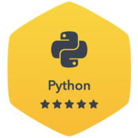
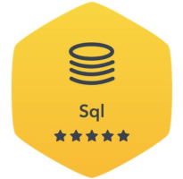
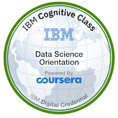

<!-- ABOUT Section Starts -->
## ABOUT

✉️: <a href = "kenny.chiangKG@gmail.com"> kenny.chiangKG@gmail.com </a>
&nbsp;&nbsp; [LinkedIn](https://www.linkedin.com/in/kenny-chiang-kai-kuang-84089959) 
&nbsp;&nbsp;&nbsp;&nbsp; [Hackerrank](https://www.hackerrank.com/kenny_chiangkg) 

<!-- Add your details -->

I am __Kenny Chiang__, an aspiring data analyst with 4.5 years of investment experience at J.P. Morgan's Private Bank in Singapore. Inspired by the rising trend of data analytics, I made the decision to switch careers and focus on my passion in research/analytics. I am a motivated self-starter, driven by solving complex problems with the willingness and desire to learn. I am also a strong communicator with the ability to tailor technical information for different audiences, honed by my prior experience as an investment advisor. 

<!-- Add link to the sections -->
[Projects](#projects)
&nbsp;&nbsp; [Certifications](#certifications)
&nbsp;&nbsp;&nbsp;&nbsp; [Experience](#experience)
&nbsp;&nbsp;&nbsp;&nbsp;&nbsp;&nbsp; [Education](#education)

***
<!-- ABOUT Section Ends -->

<!-- PROJECTS Section Starts -->
## PROJECTS
_Click on the link(s) to view the codebase_

**[[R] Cyclistic: How does a bike-share company navigate speedy success?](https://kennyckg.github.io/Google-Data-Analytics-Certificate_Cyclistic/)**  
_Google Data Analytics Certificate - Capstone_  
Exploratory Data Analysis  
<ul>
  <li> Analyzed historical trip data for a bike-share company's marketing team with the objective of converting Casual riders to Member riders </li>
</ul>

**[[Python] Applications of Machine Learning in Human Resources](https://github.com/kennyckg/Applications-of-Machine-Learning-in-HR)**  
_Personal Project, inspired by Capstone for BCG RISE_  
Exploratory Data Analysis, Multi-classification Models, Clustering Model
<ul>
  <li> Utilized a multi-classifier model (RandomForest) to identify key drivers of employees' performance with Permutation Importance for the HR team to have more effective talent conversations </li>
  <li> Built a multi-classifier model (RandomForest) to predict employees' risk of attrition to identify individuals for the HR team to intervene and retain top-talent </li>
  <li> Built a clustering model (K-means) to segment the workforce into "buckets" for broad talent-development strategies </li>
  <li> Awarded “BCG RISE Capstone Distinction (Business and Data Analytics)” among top 10 out of 50+ individuals </li>
</ul>

**[[Python] Churn Prediction Model - Telecommunications](https://github.com/kennyckg/BCG-RISE/blob/main/BCGRise_Mini-Project-3_Churn-Prediction-Model.ipynb)**  
_BCG RISE_  
Binary-classification Model
<ul>
  <li> Built a churn prediction model (Logistic Regression and RandomForest) from historical customer data for a major SEA telecommunications company </li>
  <li> Awarded “BCG RISE TOP 2 Churn Prediction Project” among a cohort of 10 groups </li>
</ul>

**[[Python] A/B Testing - Cookie Cats](https://github.com/kennyckg/BCG-RISE/blob/main/BCGRise_Mini-Project-2_AB-Testing-Cookie-Cats.ipynb)**  
_BCG RISE_  
A/B Testing
<ul>
  <li> Analyzed data from a A/B experiment for a mobile game developer to guage the efficacy of shifting the gate level from 30 to 40 </li>
</ul>

***
<!-- PROJECTS Section Ends -->

<!-- CERTIFICATIONS Section Starts -->
## CERTIFICATIONS
**GOOGLE CAREER CERTIFICATES**  
_Data Analytics Professional Certificate_ 
Jun. 2021 - Sep. 2021
<ul>
  <li> Extensive online course focused on understanding databases, database querying, data cleaning, data visualization, effective communication and data analytics using SQL, Tableau and R </li>
</ul>

**DIGITAL BOSTON CONSULTING GROUP (BCG) ACADEMY**  
_Rapid & Immersive Skill Enhancement (RISE) - Business & Data Analytics_ 
Mar. 2021 - Sep. 2021
<ul>
  <li> A six-month digital skills programme with a specialization in data analytics tools: SQL, Python, and PowerBI </li>
  <li> Graduated with Distinction, achieving a final grade among the top 10% of the cohort </li>
  <li> Achievements: </li>
    <ul>
      <li> <a href = "https://www.credly.com/badges/05f95b98-0d37-41b5-ab95-cfb569544838/public_url">BCG RISE Capstone Distinction (Business and Data Analytics)</a></li>
      <li> <a href = "https://www.credly.com/badges/f76436e8-8a12-438d-be3f-3346a739d045/public_url">BCG RISE TOP 2 Churn Prediction Project</a></li> 
      <li> <a href = "https://www.credly.com/badges/e88f7cbc-0e82-44ea-a045-e68946e931bc/public_url">BCG RISE Distinction Hackathon Project</a></li>
      <li> <a href = "https://www.credly.com/badges/cc23e7e4-9fdd-42f9-aead-fec40d45ad30/public_url">BCG RISE Top 2 Business Essentials Group Project</a></li>
  </ul>
</ul>

**OTHERS:**  
<ul>
  <li> <b>Hackerrank</b> &nbsp;&nbsp;&nbsp;&nbsp; Oct. 2021 &nbsp;&nbsp;&nbsp;&nbsp; <a href = "https://www.hackerrank.com/certificates/6327e52fc115"><i>SQL (Basic)</i></a></li>
  <li> <b>Udemy</b> &nbsp;&nbsp;&nbsp;&nbsp;&nbsp;&nbsp;&nbsp;&nbsp;&nbsp;&nbsp;&nbsp;&nbsp; Oct. 2021 &nbsp;&nbsp;&nbsp;&nbsp; <a href = "https://www.udemy.com/certificate/UC-0abf8fc2-e247-4e82-835a-8a8e832b96f4/"> <i>SQL - MySQL for Data Analytics and Business Intelligence</i></a></li>
</ul>

   
   
   

***
<!-- CERTIFICATIONS Section Ends -->

<!-- EXPERIENCE Section Starts -->
## EXPERIENCE
<!-- Add your details -->
**J.P. MORGAN WEALTH MANAGEMENT**  
_Global Investment Specialist, Associate_  
Jun. 2016 - Mar. 2021
<ul>
  <li> Engaged in asset allocation, execution, liability & collateral management, portfolio reviews, and trade-idea generation across asset classes in both public and private investments for a diverse client book of >USD 1bn in assets </li>
  <li> Analysed market movements and portfolio exposure across clients to provide advice to achieve investment objectives </li>
  <li> Active management with significant FX- and Fixed Income-orientated clients to grow trading revenue by 10-15% </li>
</ul>

**SANFORD C. BERNSTEIN**  
_Asia Equity Sales, Intern_ 
Aug. 2015 - Dec. 2015
<ul>
  <li> Assisted the team with client-servicing tasks and analysts’ marketing events; independently hosted 1-on-1s with clients </li>
  <li> Prepared equity research summaries for both daily and weekly publications to drive trading activity </li>
</ul>

**DEUTSCHE BANK**  
_Deutsche Asset & Wealth Management, Summer Intern_ 
May. 2015 - Jul. 2015
<ul>
  <li> SEA Institutional Coverage: involved with preparation of proposals for RFPs, customer profiling, and client-servicing </li>
  <li> Discretionary Portfolio Management (DPM): supported the Asia ex-Japan equity fund manager with thematic research </li>
</ul>

**BTG PACTUAL COMMODITIES (SINGAPORE)**  
_Asia Coal (Physical & Paper), Intern_ 
Jan. 2015 - Apr. 2015
<ul>
  <li> Engineered demand/supply models for key coal markets in Asia: Indonesia and Australia </li>
  <li> Analysed price curves to aid in pricing and hedging of physical trades; developed an arbitrage table for major coal routes </li>
</ul>

**HERITAS CAPITAL MANAGEMENT**  
_Private Equity, Analyst_ 
Jun. 2014 - Dec. 2014
<ul>
  <li> Interned at the Private Equity arm of IMC Pan Asia Alliance, in the Global Oil & Gas Fund and Global Resources Fund </li>
  <li> Conducted market research, due diligence on live deals, and prepared investment papers for presentation to Investment Committee </li>
</ul>

**RELIGARE CAPITAL MARKETS**  
_Equity Research (Real Estate), Summer Analyst_ 
May. 2013 - Aug. 2013
<ul>
  <li> Published a research note on a listed construction company, entailing analysis on revenue drivers and sector growth prospects </li>
  <li> Designed a spreadsheet of a simulated portfolio of the team’s buy/sell calls, to evaluate the performance of recommendations </li> 
</ul>

***
<!-- EXPERIENCE Section Ends -->

<!-- EDUCATION Section Starts -->
## EDUCATION
**SINGAPORE MANAGEMENT UNIVERSITY**  
_Bachelor of Science in Economics_ 
Aug. 2011 - May. 2016
<ul>
  <li> Double Major in Economics and Finance </li>
  <li> Cumulative GPA: 3.5 / 4.0 (Cum Laude) </li>
  <li> Awarded Dean's List for Academic Year 2015/16 </li> 
  <li> Teaching Assistant for two separate modules: Management Communication and Management Accounting; assisted the professors with curriculum matters and provided guidance to students </li> 
</ul>

**MAASTRICHT UNIVERSITY (NETHERLANDS)**  
_Overseas Exchange Programme_ 
Sep. 2013 - Dec. 2013
<ul>
  <li> A four-month study exchange specializing in Economics and Finance </li> 
</ul>

<!-- EDUCATION Section Ends -->
